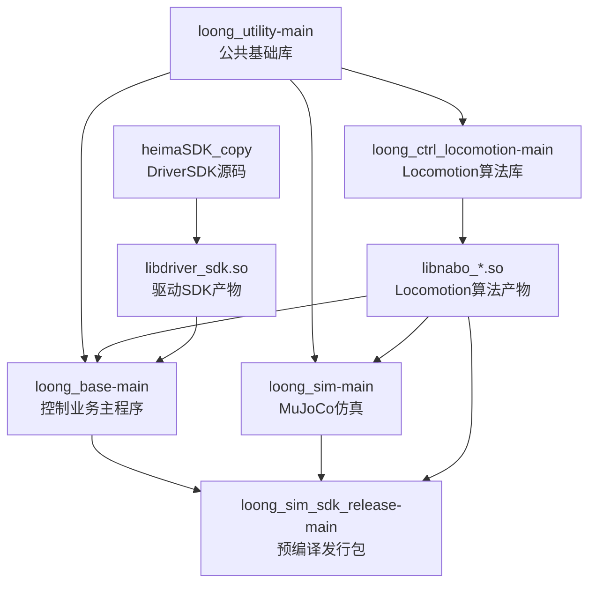
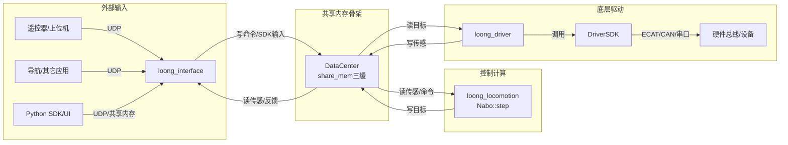

# heimaFrameWork 工程结构总览

> 本目录是一个“工作区合集”，把多个原本独立的 OpenLoong 相关仓库以 `*-main/` 的形式平铺在一起，并额外包含一份 EtherCAT 驱动 SDK 源码副本 `heimaSDK_copy/`。本文按“每个文件夹做什么/实现什么/相互关系”进行整理。

## 1. 顶层目录（一级）做什么

| 目录 | 做什么（职责） | 主要产物/用途 |
| --- | --- | --- |
| `heimaSDK_copy/` | **底层驱动 SDK**：封装 EtherCAT/CAN/RS232/RS485，提供 `DriverSDK` 控制接口；核心是 ECAT 的实时 `rxtx` 线程与“三重缓冲”数据同步 | `libdriver_sdk.so`（源码可编译），以及示例 `single_motor_demo`/`yesense_sdk_test` 等 |
| `loong_utility-main/` | **公共基础库**：算法算子、Eigen 简化、ini 解析、日志、UDP、计时等 | 供其它子工程链接（`loong_utility.cmake`） |
| `loong_ctrl_locomotion-main/` | **Locomotion 算法库**：基于 FSM/plan 组织的主控制算法（Nabo 风格），包含 RL/onnx 等 | 输出 `libnabo_{x64,a64}.so`，被 base/sim 等加载或链接 |
| `loong_base-main/` | **控制业务主程序**：把“驱动/控制/接口”等拆成多个进程任务，靠共享内存 DataCenter 互联 | 生成 `loong_driver/loong_locomotion/loong_interface` 等可执行文件 |
| `loong_sim-main/` | **MuJoCo 仿真组件**：以“算法仿真（直接调用算法库）”为主，提供简单的 sim 封装与 demo | 可执行 `main_loco`（MuJoCo + Nabo） |
| `loong_sim_sdk_release-main/` | **预编译全链仿真 SDK（发行包）**：可直接运行的全链仿真（含 share_sim、各任务进程、config/model），并提供 Python SDK/示例 | `bin/` 下的预编译可执行文件 + `sdk/` Python 包 + `py_*` 示例 |

## 2. 这些目录之间是什么关系

### 2.1 编译/链接关系（“谁依赖谁”）

说明：
- `loong_utility-main/` 是几乎所有 C++ 工程的基础依赖（ini/log/udp/timing/algorithms/eigen）。
- `loong_ctrl_locomotion-main/` 主要产出 locomotion 算法动态库（`libnabo_*.so`），被 `loong_base-main/`（实机/全链）和 `loong_sim-main/`（算法仿真）使用。
- `heimaSDK_copy/` 是 `DriverSDK`（EtherCAT 等总线驱动）的源码来源；`loong_base-main/` 里实际通常通过 `module/loong_driver_sdk/` 的**预编译 so**进行链接与运行。
- `loong_sim_sdk_release-main/` 更像“集成后的运行包”，把可执行文件、配置、模型、算法库、Python SDK 都整理在一起。

### 2.2 运行时关系（进程/数据流）

以 `loong_base-main/` 的任务拆分为核心，典型是 3 个进程（driver/locomotion/interface）通过共享内存交互：

全链仿真时（`loong_sim_sdk_release-main/`），`bin/loong_share_sim_*` 提供“仿真侧的机器人/传感/执行器”，其它任务进程（driver/interface/locomotion/mani）按与实机一致的流程跑通。

## 3. 每个目录里“做了哪些、实现了哪些”

### 3.1 `heimaSDK_copy/`：DriverSDK（EtherCAT/CAN/RS232/RS485）

定位：底层电机/传感驱动 SDK，核心是 **ECAT 实时线程 + 三重缓冲 + 结构体视图映射**。

关键实现文件（按职责分层）：
- **SDK 对外接口与总线编排**
  - `heimaSDK_copy/heima_driver_sdk.h`：`namespace DriverSDK` 的公开 API（`setMotorTarget/getMotorActual/getIMU/...`）
  - `heimaSDK_copy/heima_driver_sdk.cpp`：`DriverSDK` 单例实现；创建并管理 ECAT/CAN/串口对象；周期更新与 SDO/REG 队列
- **EtherCAT 主站封装**
  - `heimaSDK_copy/ecat.h` / `heimaSDK_copy/ecat.cpp`：请求 master、创建 domain、注册 PDO、启动 `rxtx` 周期线程（send/receive/copy）
- **三重缓冲与数据结构**
  - `heimaSDK_copy/common.h` / `heimaSDK_copy/common.cpp`：`SwapList`/`DataWrapper`/`WrapperPair`；PDO 结构体；零拷贝视图（通过 offset 映射到三缓内存）
- **配置解析**
  - `heimaSDK_copy/config_xml.h` / `heimaSDK_copy/config_xml.cpp`：解析 `heimaSDK_copy/config.xml`，生成 alias/type/domain/PDO 映射
  - `heimaSDK_copy/tinyxml2.h` / `heimaSDK_copy/tinyxml2.cpp`：内置 XML 解析库
- **其它总线与外设**
  - `heimaSDK_copy/rs232.*` + `heimaSDK_copy/yesense_imu.*` + `heimaSDK_copy/yesense/`：YeSense IMU 串口接收与三缓
  - `heimaSDK_copy/rs485.*`、`heimaSDK_copy/can.*`：其它设备链路
- **示例与调试入口**
  - `heimaSDK_copy/single_motor_demo.cpp` / `heimaSDK_copy/mt_torque_demo.cpp`：电机控制 demo
  - `heimaSDK_copy/yesense_sdk_test.cpp`：IMU 测试 demo
  - `heimaSDK_copy/ecat_domain_probe.cpp` / `heimaSDK_copy/ecat_domain_probe`：domain/offset 相关探测辅助

建议配套阅读（该目录下已有较完整的内部流程文档）：
- `heimaSDK_copy/DATAFLOW.md`（初始化→三缓→下发/回读的总览）
- `heimaSDK_copy/ECAT_TRIPLE_BUFFER_FLOW.md`（三重缓冲与 Wrapper 的绑定/时序）
- `heimaSDK_copy/ECAT_DOMAIN_FLOW.md`（多 domain 的解析与绑定）
- `heimaSDK_copy/YESENSE_SDK_TEST_FLOW.md`（IMU 串口三缓读写链路）

### 3.2 `loong_utility-main/`：公共基础库

定位：跨项目复用的 C++ 小工具集合（对上层“任务/控制/仿真”提供基础能力）。

主要实现（集中在 `loong_utility-main/src/`）：
- `algorithms.*`：限幅、滤波、阈值死区等常用算子
- `eigen.h` / `pInv.h`：Eigen 使用简化与伪逆等
- `ini.*`：`.ini` 配置读取
- `log.*`：quill 日志封装
- `udp.*`：UDP 通信封装（interface 与 python/OCU 常用）
- `timing.*`：时间/睡眠工具

其它工程通过 `loong_utility-main/loong_utility.cmake` 引入。

### 3.3 `loong_ctrl_locomotion-main/`：Locomotion 算法库（libnabo）

定位：OpenLoong locomotion 主控制算法组件（readme 中强调“FSM 调度 plan，plan 间隔离”）。

目录结构（代码在 `loong_ctrl_locomotion-main/src/`）：
- `src/manager/`：整体管理器、入口封装（对外暴露 Nabo 风格接口）
- `src/plan/`：plan 实现（复位/行走/恢复/…）
- `src/robot/`：机器人配置、模型参数、关节/末端相关抽象
- `src/common/`：算法公用模块（如摆臂等）
- `src/rl/`：RL/onnx 相关（可选 CUDA）

产物与使用方式：
- 通过 `loong_ctrl_locomotion-main/tools/make.sh` 生成 `libnabo_{x64,a64}.so`（安装到 `nabo_output/`）
- 该库在：
  - `loong_base-main/module/nabo_locomotion/`
  - `loong_sim-main/module/nabo_locomotion/`
  - `loong_sim_sdk_release-main/module/nabo_locomotion/`
  中以预编译形式出现，用于链接/运行。

### 3.4 `loong_base-main/`：控制业务主程序（任务进程 + 共享内存）

定位：把系统拆成多个“任务进程”，每个进程循环执行 `update/work/dwdate/log`，进程之间用共享内存（3-buffer）交换数据。

核心目录与实现点：
- **`loong_base-main/main/`：各任务进程入口**
  - `main/driver/`：`task_driver.cpp` 调用 `DriverSDK` 读传感、写共享内存；读共享内存的目标，调用 `DriverSDK::setMotorTarget` 下发
  - `main/locomotion/`：`task_locomotion.cpp` 从共享内存读取传感/命令，调用 `Nabo::step` 计算控制，再写回共享内存
  - `main/interface/`：`task_interface.cpp` 通过 UDP 收外部命令/SDK 数据写共享内存；并把共享内存里的反馈打包回发
  - `main/test/`：测试入口（较轻量）
- **`loong_base-main/src/`：任务基础设施**
  - `src/task_base/`：Task 基类 + `Data::dataCenterClass`（共享内存“数据中心”，集中注册各数据块）
    - 关键文件：`loong_base-main/src/task_base/data_center.h`、`loong_base-main/src/task_base/data_center.cpp`
  - `src/common/`：`Mem::shareMemClass`（共享内存 3-buffer：pos + heartbeat + 3 数据块）
    - 关键文件：`loong_base-main/src/common/share_mem.h`、`loong_base-main/src/common/share_mem.cpp`
- **`loong_base-main/module/`：运行时插件/依赖库（预编译）**
  - `module/loong_driver_sdk/`：`libloong_driver_sdk_{x64,a64}.so` + `loong_driver_sdk.h`（对接底层电机/IMU）
  - `module/nabo_locomotion/`：`libnabo_{x64,a64}.so` + `nabo.h/nabo_data.h`
  - 注意：`CMakeLists.txt` 中 rpath 还预留了 `nabo_manipulation`，但本工作区的 `loong_base-main/module/` 下未包含该目录（发行包里有）。
- **`loong_base-main/tools/`**：`make.sh`、`run_driver.sh`、`run_locomotion.sh`、`run_interface.sh` 等脚本
- **`loong_base-main/model/`**：URDF（如 `AzureLoong.urdf`）

### 3.5 `loong_sim-main/`：MuJoCo 算法仿真（直接调用算法库）

定位：更偏“算法仿真”（readme 中称 *算法仿真：直接调用 loco/mani 算法库*）。

关键内容：
- `loong_sim-main/src/sim.h` / `loong_sim-main/src/sim.cpp`：对 MuJoCo + GLFW 的轻量封装（加载 xml、step、渲染、回调）
- `loong_sim-main/main/ctrl_sim_loco/main.cpp`：直接构造 `Nabo::inputStruct/outStruct`，从 MuJoCo state 读传感、调用 `Nabo::step`，再把输出写回 `d.ctrl[]`
- `loong_sim-main/model/`：MuJoCo 模型（`scene.xml`、mesh、asset、onnx）
- `loong_sim-main/config/`：算法/线程相关 ini（如 `driver_mujoco.ini`、`thread.ini` 等）
- `loong_sim-main/module/nabo_locomotion/`：预编译 locomotion 算法库（x64）
- `loong_sim-main/tools/run_mujoco_loco.sh`：运行 `build/main_loco`

### 3.6 `loong_sim_sdk_release-main/`：预编译全链仿真 SDK（发行包）

定位：把“全链仿真运行所需的一切”打包（可执行文件 + 配置 + 模型 + 算法库 + Python SDK/示例），用于快速跑通。

目录内容：
- `loong_sim_sdk_release-main/bin/`：预编译可执行文件（x64/a64）
  - `loong_share_sim_*`：仿真侧（全链仿真关键）
  - `loong_driver_*`、`loong_interface_*`、`loong_locomotion_*`、`loong_manipulation_*`：各任务进程
- `loong_sim_sdk_release-main/config/`：运行时 ini（driver/interface/thread/plan…）；也是源码工程运行时经常需要对齐的配置来源
- `loong_sim_sdk_release-main/model/`：MuJoCo 模型、mesh、onnx
- `loong_sim_sdk_release-main/module/`：算法库 so（`nabo_locomotion`、`nabo_manipulation`）
- `loong_sim_sdk_release-main/sdk/`：Python SDK（`loong_jnt_sdk`、`loong_mani_sdk`）
- `loong_sim_sdk_release-main/py_jnt/`、`loong_sim_sdk_release-main/py_mani/`：Python 示例
- `loong_sim_sdk_release-main/tools/`：启动脚本与 UI（`py_ui.py`）

运行顺序与按键说明详见：`loong_sim_sdk_release-main/readme.md`。

## 4. 三条“从理解到跑通”的推荐路径

### 4.1 实机链路（EtherCAT）

1. `loong_base-main/main/driver/task_driver.cpp` 调 `DriverSDK`（来自 `module/loong_driver_sdk/`）  
2. `DriverSDK` 内部（对应 `heimaSDK_copy/` 的实现逻辑）通过 `ecat.cpp::rxtx` 实时线程完成 PDO send/recv  
3. 传感写入共享内存 `DataCenter`；locomotion 从共享内存取数据 → `Nabo::step` → 写回目标；driver 再从共享内存取目标下发

### 4.2 算法仿真（loong_sim-main）

1. 运行 `loong_sim-main/main/ctrl_sim_loco/main.cpp`（`tools/run_mujoco_loco.sh`）  
2. 从 MuJoCo state 读传感 → `Nabo::step` → 写 `d.ctrl[]` 驱动仿真  
3. 用于快速验证 locomotion 算法本体（不含实机全链通信）

### 4.3 全链仿真（loong_sim_sdk_release-main）

1. 启动 `tools/run_sim.sh`（share_sim）  
2. 再按 `readme.md` 的顺序启动 driver/interface/(loco)/(mani) 与 `py_ui.py`  
3. 用同一套接口完成“sim2sim-real”：仿真验证与实机运行接口一致，降低 sim2real 风险

## 5. 构建与目录命名注意点（重要）

- 这些子工程的 CMake 通常 `include(../loong_utility/loong_utility.cmake)`，但当前工作区目录名为 `loong_utility-main/`。如需从源码编译：
  - 建议在工作区根目录建立软链 `loong_utility -> loong_utility-main`（或调整各工程 CMake 的 include 路径）。
- `loong_base-main/` 源码在运行时会读取 `../config/*.ini`（例如 `driver.ini/interface.ini/thread.ini`），但该源码目录本身不包含 `config/`；本工作区里配置主要位于 `loong_sim_sdk_release-main/config/` 与 `loong_sim-main/config/`，需要按运行目录结构摆放/拷贝。

