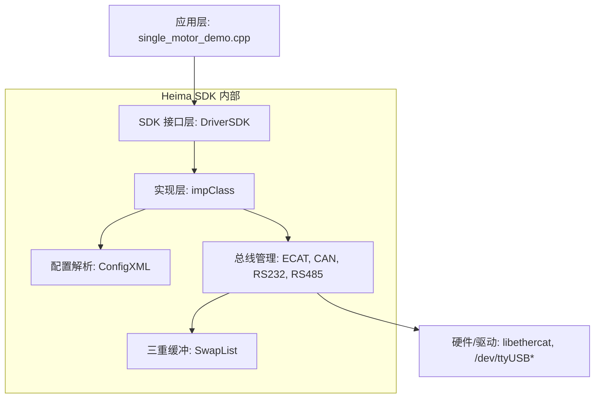
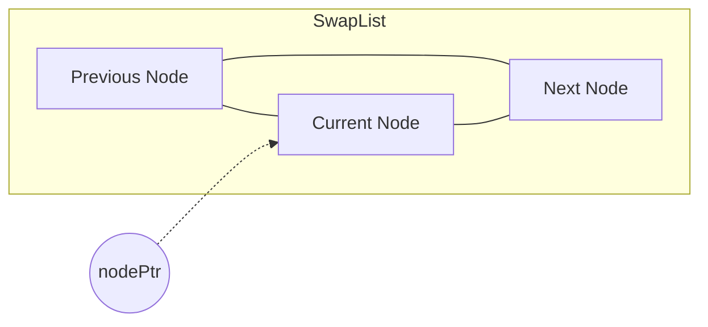
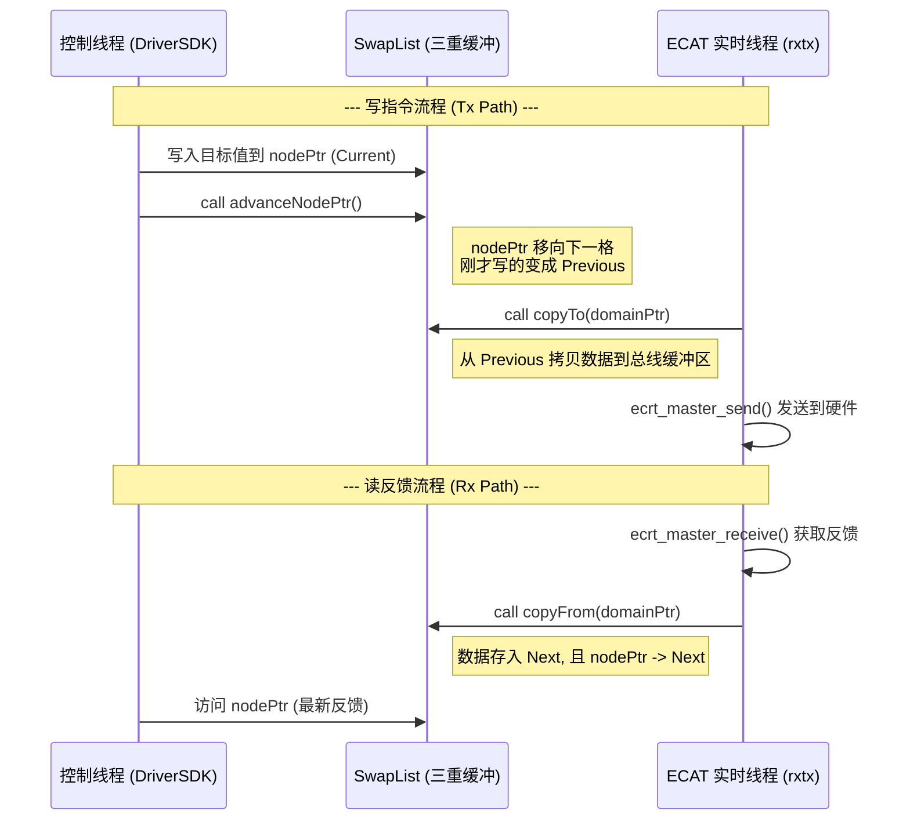
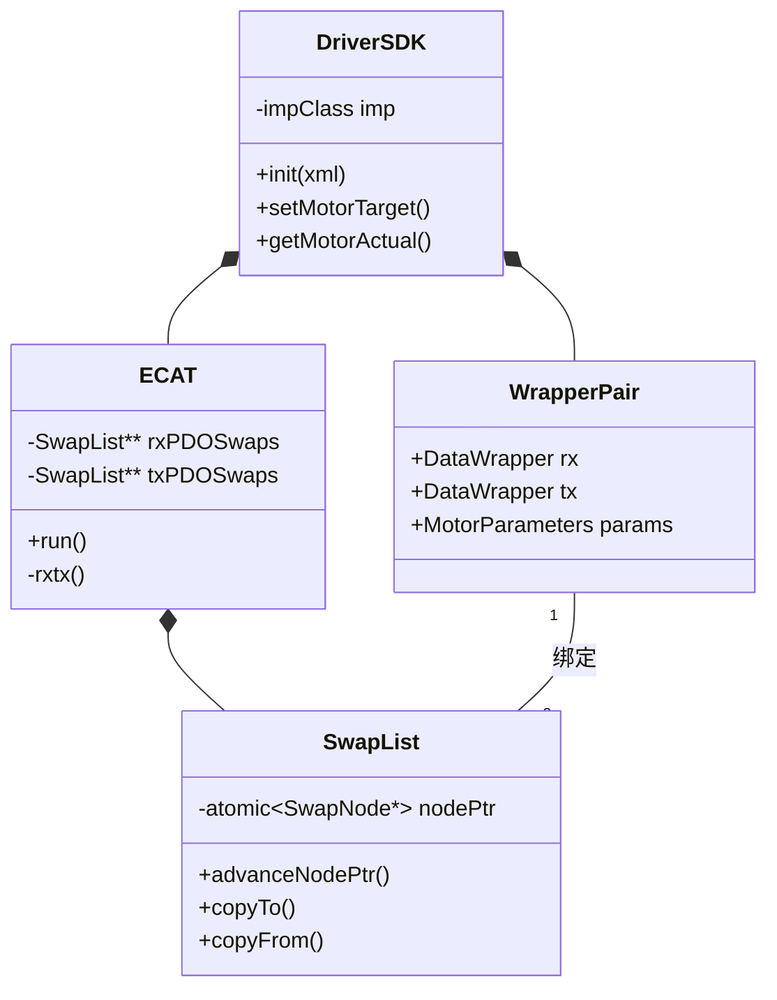

# Heima SDK 架构分析报告

本报告旨在详细解析 `heimaSDK` 的系统架构，特别是核心的 **ECAT 三重缓冲（Triple Buffer）流程**。

## 1. 整体架构概览

`heimaSDK` 采用了分层架构设计，实现了应用层逻辑与底层通信协议（EtherCAT, CAN, RS132/485）的解耦。



### 核心组件说明：
- **`DriverSDK`**: 单例模式，提供电机控制（`setMotorTarget`）和状态获取（`getMotorActual`）的高层接口。
- **`impClass`**: `DriverSDK` 的底层实现，管理各条总线实例、XML 配置以及周期性更新任务（`ecatUpdate`）。
- **`ECAT`**: 封装了 `EtherCAT` 主站操作，包含实时线程 `rxtx`。
- **`SwapList`**: **三重缓冲的核心实现**，解决跨线程数据同步。
- **`WrapperPair` / `DataWrapper`**: 建立起“三缓原始内存”与“C++ 结构体”之间的映射（视图）。

---

## 2. ECAT 三重缓冲 (ECAT_TRIPLE_BUFFER_FLOW) 深度解析

为了保证实时线程（`rxtx`）与非实时控制线程（`App/SDK`）互不干扰且数据一致，系统为每个 EtherCAT 域（Domain）维护了一对三重缓冲。

### 2.1 三重缓冲数据结构 (`SwapList`)

每个 `SwapList` 由 3 个 `SwapNode` 组成一个环形链表。



- **`nodePtr`**: 原子指针，始终指向“当前”节点。
- **`Previous`**: 通常存放“已准备好发送”或“已解析完”的上一帧数据。
- **`Next`**: 存放“正在写入”或“即将被覆盖”的下一帧数据。

### 2.2 核心流程：一次完整的读写循环



### 2.3 内存映射机制 (`DataWrapper`)

`DataWrapper` 的巧妙之处在于它不存储数据，而是重载了 `->` 运算符：

```cpp
Data* operator->(){ 
    return (Data*)(swap->nodePtr.load()->memPtr + offset); 
}
```

- **偏移量 (`offset`)**: 在 `ECAT::config` 阶段通过 `ecrt_slave_config_reg_pdo_entry` 获取。
- **零拷贝视图**: `drivers[i].rx->TargetTorque` 直接操作的就是对应 `SwapNode` 的内存空间。

---

## 3. 关键文件依赖关系



## 4. 总结

`heimaSDK` 的架构设计的核心在于 **“内存视图映射 + 环形三重缓冲”**。
1. **安全性**: 采用 `std::atomic` 和三缓冲区，避免了高频控制下的 Data Race。
2. **高效性**: 读写过程通过指针强转，几乎没有额外的序列化开销。
3. **灵活性**: 通过 `ConfigXML` 动态配置从站与域的对应关系，支持复杂的多轴同步控制。
